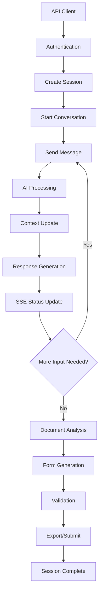

# Chat Engine Tax Filing Service - Product Requirements Document

## 1. Product Overview

A conversational AI-powered chat engine service that transforms traditional rigid tax filing workflows into an intuitive, chat-based experience. The service provides seamless integration capabilities for third-party applications while handling complex tax data processing and automation through natural language interactions.

The engine addresses the complexity and user friction in traditional tax filing systems by leveraging AI to guide users through personalized conversations, automatically extracting and processing tax information, and managing multiple concurrent filing sessions with real-time performance optimization.

Target market: Tax preparation software companies, financial institutions, and accounting firms seeking to modernize their tax filing experience and improve user engagement through conversational interfaces.

## 2. Core Features

### 2.1 User Roles

| Role | Registration Method | Core Permissions |
|------|---------------------|------------------|
| API Client | API key authentication | Can create sessions, initiate conversations, access filing data |
| System Admin | Internal authentication | Can monitor sessions, view analytics, manage system configuration |

### 2.2 Feature Module

Our chat engine service consists of the following main API endpoints and modules:

1. **Session Management API**: Session creation, session state management, concurrent session handling
2. **Conversation Engine**: Natural language processing, tax-specific conversation flows, context management
3. **Tax Filing Processor**: Document analysis, form generation, validation and submission workflows
4. **Real-time Communication**: Server-sent events streaming, status updates, progress notifications
5. **Job Management System**: Parallel processing, queue management, job status tracking
6. **Integration API**: Webhook support, data export, external system connectivity

### 2.3 Page Details

| Module Name | Feature Name | Feature Description |
|-------------|--------------|---------------------|
| Session Management API | Create Session | Initialize new tax filing session with unique session ID, user context, and configuration parameters |
| Session Management API | Session State Management | Maintain conversation history, user data, and filing progress across multiple interactions |
| Session Management API | Concurrent Session Handling | Support multiple active sessions per client with isolation and resource management |
| Conversation Engine | Natural Language Processing | Process user inputs using OpenAI integration to understand tax-related queries and extract relevant information |
| Conversation Engine | Tax Conversation Flows | Guide users through tax filing steps using contextual conversations, form identification, and data collection |
| Conversation Engine | Context Management | Maintain conversation context, remember previous inputs, and provide personalized responses |
| Tax Filing Processor | Document Analysis | Analyze uploaded tax documents, extract data using AI, and populate appropriate tax forms |
| Tax Filing Processor | Form Generation | Generate completed tax forms based on conversation data and document analysis |
| Tax Filing Processor | Validation and Submission | Validate tax data completeness, check for errors, and prepare submission packages |
| Real-time Communication | SSE Streaming | Implement server-sent events for real-time status updates and progress notifications |
| Real-time Communication | Status Updates | Broadcast processing status, completion notifications, and error alerts to connected clients |
| Real-time Communication | Progress Notifications | Send step-by-step progress updates during document processing and form generation |
| Job Management System | Parallel Processing | Execute multiple tax filing jobs simultaneously with resource allocation and priority management |
| Job Management System | Queue Management | Manage job queues, handle job scheduling, and implement retry mechanisms for failed jobs |
| Job Management System | Job Status Tracking | Track job lifecycle, provide detailed status information, and maintain job history |
| Integration API | Webhook Support | Send notifications and data updates to external systems via configurable webhooks |
| Integration API | Data Export | Export tax filing data in various formats (JSON, PDF, XML) for external system integration |
| Integration API | External System Connectivity | Provide RESTful APIs for seamless integration with existing tax software and platforms |

## 3. Core Process

### API Client Flow
1. Client authenticates using API key and creates a new tax filing session
2. Client initiates conversation by sending user message to the chat endpoint
3. Engine processes message using AI, maintains context, and responds with guidance or questions
4. Client receives real-time updates via SSE connection for processing status
5. User continues conversation, uploading documents and providing information as guided
6. Engine analyzes documents, extracts data, and populates tax forms automatically
7. Client receives completed forms and validation results
8. Client can submit forms or export data for external processing

### System Admin Flow
1. Admin monitors active sessions and system performance through admin endpoints
2. Admin can view job queues, processing statistics, and error logs
3. Admin manages system configuration and API client permissions
4. Admin receives alerts for system issues or failed processing jobs

## 4. User Interface Design

### 4.1 Design Style

Since this is a backend service with no frontend, the design considerations focus on API response structure and data presentation:

- **Response Format**: Clean JSON structure with consistent field naming and hierarchical organization
- **Status Codes**: Standard HTTP status codes with detailed error messages and success indicators
- **Data Validation**: Comprehensive input validation with clear error descriptions and suggested corrections
- **Documentation Style**: OpenAPI/Swagger specification with interactive documentation and code examples
- **Logging Format**: Structured JSON logs with timestamp, session ID, and detailed context information

### 4.2 API Design Overview

| API Endpoint | Method | Purpose | Response Format |
|--------------|--------|---------|-----------------|
| /api/sessions | POST | Create new session | JSON with session ID, configuration, and initial state |
| /api/sessions/{id}/chat | POST | Send message to conversation | JSON with AI response, context updates, and next steps |
| /api/sessions/{id}/upload | POST | Upload tax documents | JSON with analysis results and extracted data |
| /api/sessions/{id}/forms | GET | Retrieve generated forms | JSON with form data and completion status |
| /api/sessions/{id}/events | GET | SSE endpoint for real-time updates | Server-sent events stream with status and progress |
| /api/jobs/{id}/status | GET | Check job processing status | JSON with job state, progress percentage, and estimated completion |

### 4.3 Integration Considerations

The service is designed as a headless backend with comprehensive API documentation, SDK support for popular programming languages, and webhook capabilities for real-time integration. All endpoints support CORS for web-based integrations and provide detailed error handling for robust client implementation.