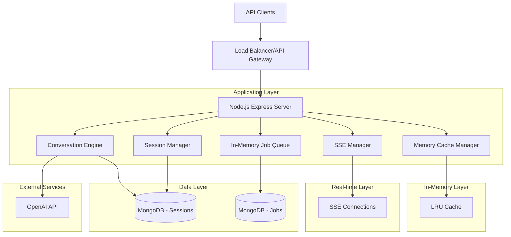

# Chat Engine Tax Filing Service - Technical Architecture Document

## 1. Architecture Design



## 2. Technology Description

* **Backend**: Node.js\@18 + Express\@4 + TypeScript\@5

* **Database**: MongoDB\@6 (Primary storage, sessions, jobs)

* **Caching**: LRU-Cache\@7 (In-memory caching)

* **AI Integration**: OpenAI API\@4

* **Real-time**: Server-Sent Events (SSE)

* **Queue System**: In-memory job queue with MongoDB persistence

* **Authentication**: JWT + API Key validation

* **Documentation**: Swagger/OpenAPI\@3

* **Testing**: Jest + Supertest

* **Monitoring**: Winston logging + Morgan middleware

## 3. Route Definitions

| Route                            | Purpose                                       |
| -------------------------------- | --------------------------------------------- |
| POST /api/v1/auth/validate       | Validate API key and generate session token   |
| POST /api/v1/sessions            | Create new tax filing session                 |
| GET /api/v1/sessions/:id         | Retrieve session details and current state    |
| POST /api/v1/sessions/:id/chat   | Send message to conversation engine           |
| POST /api/v1/sessions/:id/upload | Upload tax documents for analysis             |
| GET /api/v1/sessions/:id/forms   | Retrieve generated tax forms                  |
| GET /api/v1/sessions/:id/events  | SSE endpoint for real-time updates            |
| POST /api/v1/sessions/:id/submit | Submit completed tax filing                   |
| GET /api/v1/jobs/:id/status      | Check job processing status                   |
| POST /api/v1/webhooks/configure  | Configure webhook endpoints for notifications |
| GET /api/v1/health               | Health check endpoint                         |
| GET /api/v1/docs                 | API documentation (Swagger UI)                |

## 4. API Definitions

### 4.1 Core API

**Session Management**

```
POST /api/v1/sessions
```

Request:

| Param Name    | Param Type | isRequired | Description                                     |
| ------------- | ---------- | ---------- | ----------------------------------------------- |
| clientId      | string     | true       | Unique identifier for the API client            |
| userId        | string     | true       | End user identifier for the tax filing session  |
| taxYear       | number     | true       | Tax year for filing (e.g., 2023)                |
| filingType    | string     | true       | Type of tax filing (individual, business, etc.) |
| configuration | object     | false      | Session-specific configuration options          |

Response:

| Param Name | Param Type | Description                                 |
| ---------- | ---------- | ------------------------------------------- |
| sessionId  | string     | Unique session identifier                   |
| status     | string     | Session status (active, pending, completed) |
| createdAt  | string     | Session creation timestamp                  |
| expiresAt  | string     | Session expiration timestamp                |

Example:

```json
{
  "clientId": "client_123",
  "userId": "user_456",
  "taxYear": 2023,
  "filingType": "individual",
  "configuration": {
    "language": "en",
    "complexity": "standard"
  }
}
```

**Conversation Engine**

```
POST /api/v1/sessions/:id/chat
```

Request:

| Param Name  | Param Type | isRequired | Description                                      |
| ----------- | ---------- | ---------- | ------------------------------------------------ |
| message     | string     | true       | User message or query                            |
| messageType | string     | false      | Type of message (text, command, file\_reference) |
| context     | object     | false      | Additional context for the conversation          |

Response:

| Param Name    | Param Type | Description                                 |
| ------------- | ---------- | ------------------------------------------- |
| response      | string     | AI-generated response                       |
| suggestions   | array      | Suggested next actions or questions         |
| extractedData | object     | Any tax data extracted from the message     |
| nextStep      | string     | Recommended next step in the filing process |
| confidence    | number     | AI confidence score (0-1)                   |

**Document Upload**

```
POST /api/v1/sessions/:id/upload
```

Request:

| Param Name   | Param Type | isRequired | Description                                |
| ------------ | ---------- | ---------- | ------------------------------------------ |
| file         | file       | true       | Tax document file (PDF, image, etc.)       |
| documentType | string     | true       | Type of document (W2, 1099, receipt, etc.) |
| description  | string     | false      | Optional description of the document       |

Response:

| Param Name       | Param Type | Description                                 |
| ---------------- | ---------- | ------------------------------------------- |
| documentId       | string     | Unique identifier for the uploaded document |
| extractedData    | object     | Data extracted from the document            |
| confidence       | number     | Extraction confidence score                 |
| processingStatus | string     | Status of document processing               |

## 5. Server Architecture Diagram

````mermaid
graph TD
    A[Client Request] --> B[API Gateway Layer]
    B --> C[Authentication Middleware]
    C --> D[Rate Limiting Middleware]
    D --> E[Request Validation Middleware]
    E --> F[Controller Layer]
    F --> G[Service Layer]
    G --> H[Repository Layer]
    H --> I[(Database)]
    
    G --> J[External API Layer]
    J --> K[OpenAI Service]
    J --> L[Tax Service APIs]
    
    G --> M[In-Memory Queue Service]
    M --> N[Job Processors]
    N --> O[Background Workers]
    N --> P[(MongoDB - Job Persistence)]
    
    F --> Q[SSE Manager]
    Q --> R[Real-time Connections]
    
    subgraph "Express Server"
        B
        C
        D
        E
        F
    end
    
    subgraph "Business Logic"
        G
        H
    end
    
    subgraph "External Integration"
        J
        K
        L
    end
    
    subgraph "Background Processing"
        M
        N
        O
        P
    end

## 6. System Components (Redis-Free Implementation)

### 6.1 In-Memory Caching Strategy

**LRU Cache Implementation:**
- **Library**: `lru-cache` for efficient memory management
- **Use Cases**: 
  - Session data caching (frequently accessed sessions)
  - OpenAI API response caching (common tax questions)
  - Document processing results caching
  - User context caching for faster conversation flow

**Cache Configuration:**
```javascript
const LRU = require('lru-cache');

const sessionCache = new LRU({
  max: 1000,           // Maximum 1000 sessions in memory
  ttl: 1800000,        // 30 minutes TTL
  updateAgeOnGet: true // Reset TTL on access
});

const aiResponseCache = new LRU({
  max: 5000,           // Cache 5000 AI responses
  ttl: 3600000,        // 1 hour TTL
  updateAgeOnGet: true
});
````

### 6.2 In-Memory Job Queue System

**Queue Implementation:**

* **Primary**: In-memory priority queue using JavaScript Map/Array

* **Persistence**: MongoDB for job state persistence and recovery

* **Workers**: Node.js worker threads for parallel processing

**Job Queue Architecture:**

```javascript
class JobQueue {
  constructor() {
    this.queues = new Map(); // jobType -> priority queue
    this.workers = new Map(); // jobType -> worker pool
    this.processing = new Set(); // currently processing jobs
  }
  
  async addJob(jobType, payload, priority = 0) {
    // Add to in-memory queue and persist to MongoDB
  }
  
  async processJobs(jobType) {
    // Process jobs from memory with MongoDB state updates
  }
}
```

### 6.3 Session Management

**Session Storage:**

* **Primary**: MongoDB for persistent session data

* **Cache**: LRU cache for active session quick access

* **Cleanup**: Automatic session expiration using MongoDB TTL indexes

**Session Lifecycle:**

1. Create session → Store in MongoDB + Cache
2. Access session → Check cache first, fallback to MongoDB
3. Update session → Update both cache and MongoDB
4. Expire session → Automatic cleanup via MongoDB TTL

### 6.4 Real-Time Communication

**SSE Implementation:**

* **Event Emitter**: Node.js EventEmitter for in-process communication

* **Connection Management**: Map of active SSE connections

* **Message Broadcasting**: Direct memory-based event distribution

**SSE Manager:**

```javascript
class SSEManager {
  constructor() {
    this.connections = new Map(); // sessionId -> SSE connection
    this.eventEmitter = new EventEmitter();
  }
  
  addConnection(sessionId, res) {
    // Add SSE connection for session
  }
  
  broadcast(sessionId, event, data) {
    // Send event to specific session
  }
}
```

````

## 7. Data Model

### 7.1 Data Model Definition

```mermaid
erDiagram
    SESSION ||--o{ CONVERSATION : contains
    SESSION ||--o{ DOCUMENT : has
    SESSION ||--o{ TAX_FORM : generates
    SESSION ||--o{ JOB : creates
    
    CLIENT ||--o{ SESSION : owns
    USER ||--o{ SESSION : participates
    
    SESSION {
        string id PK
        string clientId FK
        string userId FK
        number taxYear
        string filingType
        string status
        object configuration
        datetime createdAt
        datetime updatedAt
        datetime expiresAt
    }
    
    CLIENT {
        string id PK
        string name
        string apiKey
        array permissions
        object settings
        datetime createdAt
    }
    
    USER {
        string id PK
        string email
        string name
        object profile
        datetime createdAt
    }
    
    CONVERSATION {
        string id PK
        string sessionId FK
        string messageType
        string userMessage
        string aiResponse
        object extractedData
        number confidence
        datetime timestamp
    }
    
    DOCUMENT {
        string id PK
        string sessionId FK
        string filename
        string documentType
        string storageUrl
        object extractedData
        string processingStatus
        datetime uploadedAt
    }
    
    TAX_FORM {
        string id PK
        string sessionId FK
        string formType
        object formData
        string status
        datetime generatedAt
        datetime submittedAt
    }
    
    JOB {
        string id PK
        string sessionId FK
        string jobType
        string status
        object payload
        object result
        number progress
        datetime createdAt
        datetime completedAt
    }
````

### 7.2 Data Definition Language

**Sessions Collection**

```javascript
// MongoDB Collection: sessions
{
  _id: ObjectId,
  sessionId: String, // Unique session identifier
  clientId: String, // API client identifier
  userId: String, // End user identifier
  taxYear: Number, // Tax year for filing
  filingType: String, // Type of filing (individual, business, etc.)
  status: String, // active, processing, completed, expired, error
  configuration: {
    language: String,
    complexity: String,
    preferences: Object
  },
  context: {
    currentStep: String,
    completedSteps: [String],
    extractedData: Object,
    formProgress: Object
  },
  createdAt: Date,
  updatedAt: Date,
  expiresAt: Date
}

// Index creation
db.sessions.createIndex({ sessionId: 1 }, { unique: true })
db.sessions.createIndex({ clientId: 1, userId: 1 })
db.sessions.createIndex({ status: 1 })
db.sessions.createIndex({ expiresAt: 1 }, { expireAfterSeconds: 0 })
```

**Conversations Collection**

```javascript
// MongoDB Collection: conversations
{
  _id: ObjectId,
  conversationId: String,
  sessionId: String,
  messageType: String, // text, command, file_reference
  userMessage: String,
  aiResponse: String,
  extractedData: Object,
  confidence: Number,
  processingTime: Number,
  timestamp: Date
}

// Index creation
db.conversations.createIndex({ sessionId: 1, timestamp: -1 })
db.conversations.createIndex({ conversationId: 1 }, { unique: true })
```

**Documents Collection**

```javascript
// MongoDB Collection: documents
{
  _id: ObjectId,
  documentId: String,
  sessionId: String,
  filename: String,
  originalName: String,
  documentType: String, // W2, 1099, receipt, etc.
  mimeType: String,
  fileSize: Number,
  storageUrl: String,
  extractedData: Object,
  processingStatus: String, // pending, processing, completed, error
  confidence: Number,
  uploadedAt: Date,
  processedAt: Date
}

// Index creation
db.documents.createIndex({ documentId: 1 }, { unique: true })
db.documents.createIndex({ sessionId: 1 })
db.documents.createIndex({ processingStatus: 1 })
```

**Jobs Collection**

```javascript
// MongoDB Collection: jobs
{
  _id: ObjectId,
  jobId: String,
  sessionId: String,
  jobType: String, // document_analysis, form_generation, submission
  status: String, // queued, processing, completed, failed
  priority: Number,
  payload: Object,
  result: Object,
  progress: Number, // 0-100
  attempts: Number,
  maxAttempts: Number,
  error: String,
  createdAt: Date,
  startedAt: Date,
  completedAt: Date
}

// Index creation
db.jobs.createIndex({ jobId: 1 }, { unique: true })
db.jobs.createIndex({ sessionId: 1 })
db.jobs.createIndex({ status: 1, priority: -1 })
db.jobs.createIndex({ createdAt: -1 })
```

**API Clients Collection**

```javascript
// MongoDB Collection: clients
{
  _id: ObjectId,
  clientId: String,
  name: String,
  apiKey: String, // Hashed
  permissions: [String],
  rateLimit: {
    requestsPerMinute: Number,
    requestsPerHour: Number,
    requestsPerDay: Number
  },
  settings: Object,
  isActive: Boolean,
  createdAt: Date,
  lastUsed: Date
}

// Index creation
db.clients.createIndex({ clientId: 1 }, { unique: true })
db.clients.createIndex({ apiKey: 1 }, { unique: true })
db.clients.createIndex({ isActive: 1 })
```

**Initial Data Setup**

```javascript
// Create default API client
db.clients.insertOne({
  clientId: "default_client",
  name: "Default API Client",
  apiKey: "$2b$10$hashed_api_key_here",
  permissions: ["session:create", "session:read", "conversation:send", "document:upload"],
  rateLimit: {
    requestsPerMinute: 60,
    requestsPerHour: 1000,
    requestsPerDay: 10000
  },
  settings: {
    maxSessionDuration: 3600000, // 1 hour in milliseconds
    maxDocumentSize: 10485760, // 10MB
    supportedFileTypes: ["pdf", "jpg", "png", "doc", "docx"]
  },
  isActive: true,
  createdAt: new Date()
})
```

